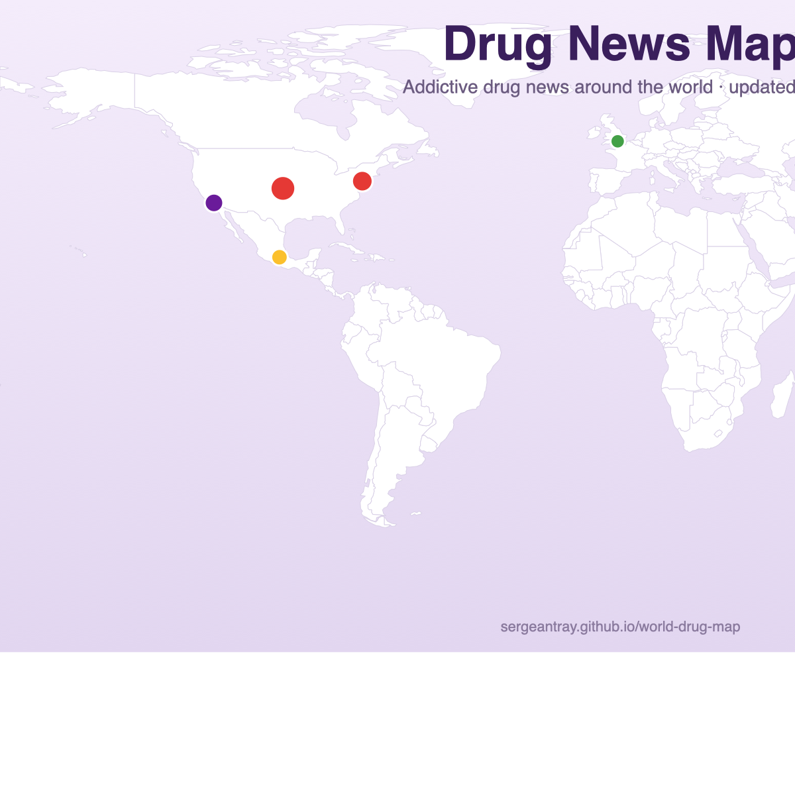

# 💊 Drug News Map

A **live world map of addictive drug news** — opioids & fentanyl, heroin, cocaine, meth, cannabis, alcohol and more. Every dot is a story, colored by the drug it's about; overlapping stories split the dot like a pie.

**👉 Live at: https://sergeantray.github.io/drug-news-map/**

---

## ✨ Features

- **Colored by drug type** — red = opioids/fentanyl, brown = heroin, gold = cocaine, purple = meth, green = cannabis, blue = alcohol, gray = other
- **Pie dots** — several stories at one spot split the dot into wedges, one per drug
- **Live filtering** — click a drug chip to show only that drug; a mixed dot recolors instantly
- **Zoom & pan** — scroll to zoom, drag to pan, dark mode toggle
- **Auto-updated daily** — fresh headlines every morning from NYT Health, KFF Health News, STAT and ScienceDaily
- **100% self-contained** — a single HTML file, no map library, works offline

## 🗺️ How it works

- News is classified by drug type from keywords (opioid, fentanyl, overdose, meth, cannabis, alcohol…)
- A story mentioning an exact place (city / state / country) gets a dot or a colored border
- The map is pure SVG generated in Python — same projection for base map and markers

## 🛠️ Tech

| Piece | What |
|---|---|
| Map | Hand-built SVG (equirectangular, 2000×1000) from Natural Earth GeoJSON |
| Interaction | Vanilla JavaScript — no frameworks |
| News | NYT Health, KFF Health News, STAT News, ScienceDaily — filtered to drug-related stories |
| Hosting | GitHub Pages (this repo) |

## 🔄 Updates

Rebuilds and re-deploys automatically every morning. News links belong to their respective publishers; map borders: Natural Earth (public domain).
